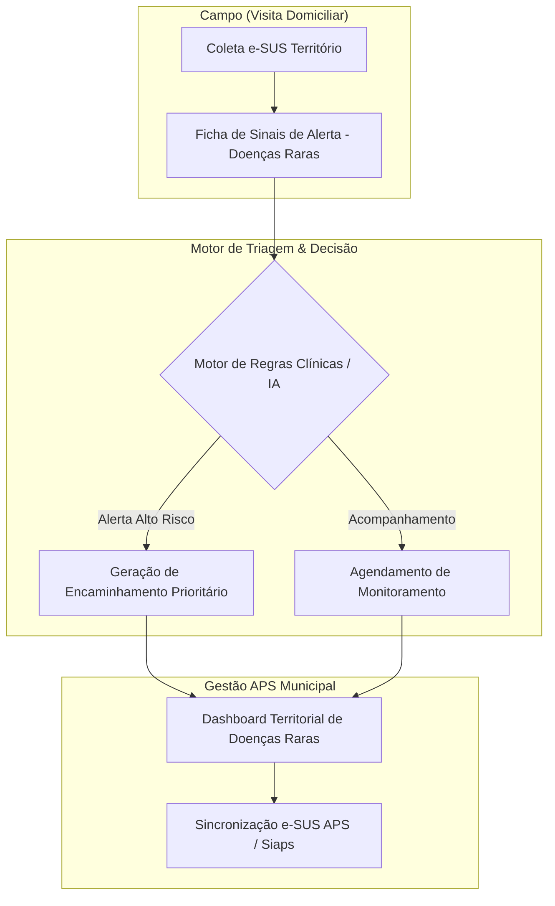

# Plano de Desenvolvimento — Raramente Hackathon

## 1. Visão Geral e Propósito

O **Raramente Hackathon** busca transformar a Atenção Primária à Saúde (APS) no Brasil capacitando os **Agentes Comunitários de Saúde (ACS)** na identificação precoce, triagem e encaminhamento de pessoas com **doenças raras**.

Integrando-se ao fluxo de coleta do **e-SUS Território** e à base do **e-SUS APS** (com transição para a infraestrutura nacional **Siaps/SISAB**), o sistema oferece suporte à decisão no momento da visita domiciliar, mapeamento territorial de casos suspeitos e inteligência para gestão municipal de saúde.

---

## 2. Escopo e Módulos do Sistema

### Módulo 1: Aplicação Mobile / PWA para ACS (Campo)
- **Ficha Dinâmica de Triagem**: Questionários de sinais de alerta e marcos de desenvolvimento (para pediatria/doenças genéticas/raras).
- **Modo Offline-First**: Permite registro de visitas sem conexão à internet e sincroniza ao conectar.
- **Alertas em Tempo Real**: Indicadores visuais de bandeiras vermelhas (*red flags*) de doenças raras.

### Módulo 2: Motor de Triagem Inteligente (Backend)
- **Cruzamento de Sintomas**: Algoritmo de mapeamento de sinais/sintomas com catálogos ontológicos de doenças raras (ex: ORPHANET, HPO, ICD-10/11).
- **Score de Suspeita**: Pontuação de risco para auxílio na triagem médica na Unidade Básica de Saúde (UBS).

### Módulo 3: Painel de Gestão Territorial & Analytics (Web)
- **Mapa de Calor Epidemiológico**: Visualização geográfica de casos suspeitos e confirmados por microárea do ACS.
- **Painel de Indicadores APS**: Métricas de acompanhamento de famílias atípicas e metas de cobertura municipal.
- **Relatórios Consolidados**: Geração de dados para repasse de financiamento e planejamento de ações de saúde pública.

### Módulo 4: Camada de Sincronização & Integração
- **Conector e-SUS APS**: Exportação no formato e-SUS / Thrift / FHIR.
- **Adequação ao Siaps/SISAB**: Preparado para a migração nacional do Ministério da Saúde.

---

## 3. Roadmap de Desenvolvimento (Fases)

### Fase 1: Alinhamento de Requisitos e Modelagem (Sprint 1)
- [ ] Definir o catálogo de sinais de alerta prioritários para a triagem do ACS.
- [ ] Modelar a estrutura de dados (ACS, Paciente, Visita, Sinais de Alerta, Encaminhamento).
- [ ] Desenhar os protótipos de baixa e alta fidelidade das telas do ACS e do Gestor.

### Fase 2: Desenvolvimento do MVP — Core e Interface (Sprint 2)
- [ ] Criar a interface responsiva da Ficha de Triagem do ACS.
- [ ] Desenvolver as APIs REST para recebimento dos dados de visitas.
- [ ] Implementar a regra inicial de alerta para doenças raras.

### Fase 3: Dashboard de Gestão e Triagem Avançada (Sprint 3)
- [ ] Desenvolver o Painel Web da UBS com Mapa Territorial.
- [ ] Integrar motor de busca e identificação de padrões de sintomas.
- [ ] Implementar simulação de integração com e-SUS APS.

### Fase 4: Testes, Validação e Preparação para o Pitch (Sprint 4)
- [ ] Realizar testes de usabilidade simulando a rotina do ACS.
- [ ] Popular a aplicação com dados fictícios para demonstração.
- [ ] Preparar a documentação do projeto e apresentação para a banca avaliadora.

---

## 4. Arquitetura Tecnológica Sugerida

| Camada | Tecnologia Recomendada | Justificativa |
| :--- | :--- | :--- |
| **Frontend ACS (PWA)** | React / Vite / Tailwind CSS | Leve, responsivo, suporte offline (Service Workers). |
| **Dashboard Gestão** | React / Next.js | Renderização ágil, gráficos dinâmicos e mapa interativo. |
| **Backend API** | Node.js (Express/Fastify) ou Python (FastAPI) | Alta performance, facilidade de manipulação de JSON/APIs. |
| **Banco de Dados** | PostgreSQL + PostGIS | Excelente suporte a dados estruturados e geoprocessamento. |
| **Mapas & Gráficos** | Leaflet / Mapbox & Chart.js / Recharts | Mapas leves para visualização territorial de microáreas. |

---

## 5. Próximos Passos Imediatos

1. Validar a proposta do plano de desenvolvimento com o time do Hackathon.
2. Definir a stack exata a ser utilizada no MVP.
3. Iniciar a criação dos componentes da interface do ACS.
